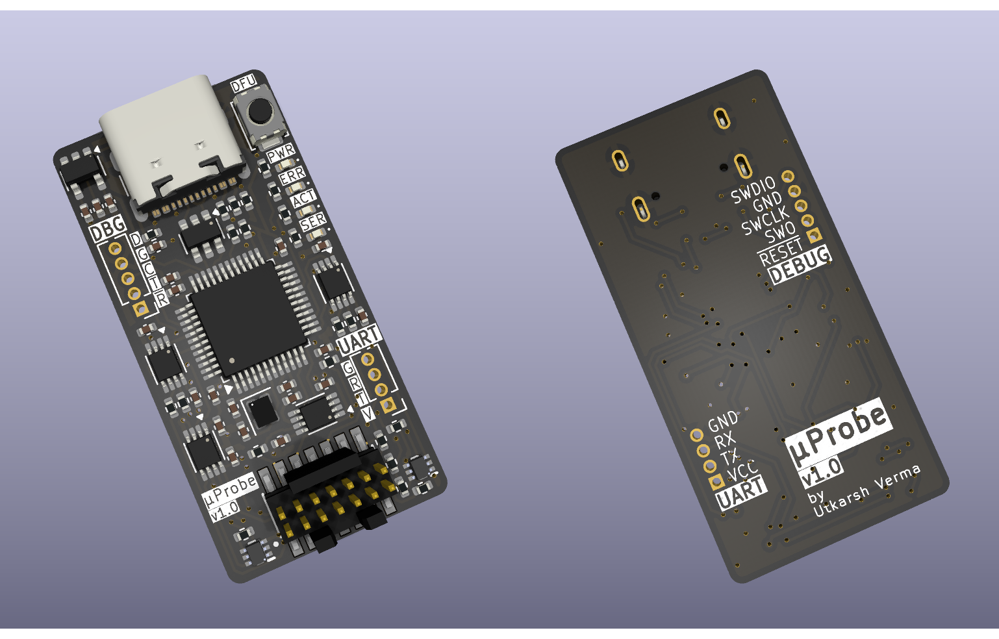

# μProbe

This probe is my personal take on the [Black Magic Debug][bmp] project's [Black Magic Probe v2.1][bmp-2.1]. I was disappointed to find out that I could not use my STLink v3 on non-ST targets[^1], even when they used the same protocol. One thing led to another and I stumbled upon the Black Magic Probe. The idea of having a configurable debugger appealed to me. This combined with an itch to work on a hardware project is what brought μProbe into existence.

> [!note]
> Please buy the official Black Magic Probe if you can! It is necessary to support the awesome work that the folks at the Black Magic project do.

## Possible future improvements

- Improve nASSERT_TVREF circuitry.
- Switch to a more powerful MCU.
- Add USB-C power negotiation.
- Add AUX connector from BMP v2.3.

## Credits

This project would not have been possible without the following resources:

- [Black Magic Debug v2.1e schematic][bmp]
- 3D models:
  - [4-pin SMT crystal osciallator by Steven Minichiello][xtal]

Lastly, I would also like to thank the warm community at 1BitSquared's Discord server for their insights and help.

[bmp]: https://black-magic.org/
[bmp-2.1]: https://black-magic.org/hardware.html#black-magic-probe-mini-v2-1-bmp21
[xtal]: https://grabcad.com/library/sitime-2016-4-pin-smt-mems-crystal-oscillator-to-20-ppm-1

[^1]: https://sourceforge.net/p/openocd/tickets/275/
